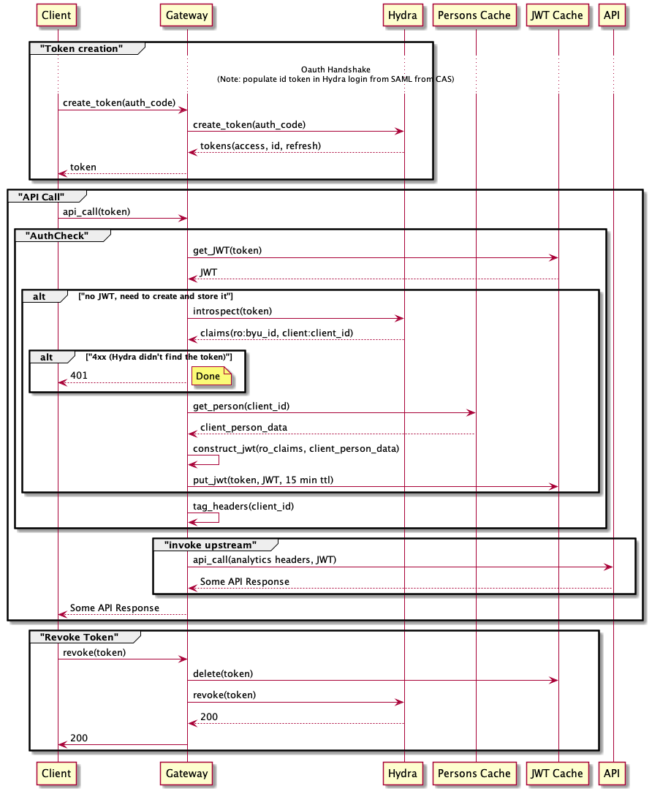

# Tyk Architecture

## Component overview and traffic routing

There will be three gateways: Oregon, Virginia, and Provo. Tyk will manage the gateways in Oregon and Virginia. BYU will manage the gateway in Provo.

We will use a Route 53 Hosted Zone, and Record Sets with geo-proximity Routing to route client traffic to the closest gateway.

An SSL Certificate will be added to each node where SSL termination takes place. These nodes are red in the diagram above. They include:

* Tyk Developer Portal (SaaS)
* Tyk Dashboard (SaaS)
* Tyk Managed Gateway (SaaS, Oregon)
* Tyk Managed Gateway (SaaS, Virginia)
* BYU Reverse Proxy (Provo)

For APIs that only have a single instance, all gateways will route traffic to that single instance.

For APIs that have instances in multiple regions, the gateways will route traffic to the closest instance. It will be the responsibility of the API provider (aka domain team) to implement geo-proximity based routing for their API. The API Management team will implement the echo API as a multi-region API to prove this functionality out, and to provide a reference implementation for other teams.

## OAuth Tokens and JWTs

All API clients will use OAuth 2.0 for authentication. The supported grant types will include:

* Auth Code
* Implicit
* PKCE
* Client Credentials

Almost all APIs will accept a JWT that contains the claims listed at [https://developer.byu.edu/docs/design-api/byu-usage-json-web-token](https://developer.byu.edu/docs/design-api/byu-usage-json-web-token). Custom code running on the gateways will be responsible for translating OAuth access tokens into JWTs with the appropriate claims.

A couple of our API platforms are not able to consume JWTs (notably, PeopleSoft and C-Framework). Rather, these platforms accept identity data via an HTTP header. Currently, these platforms are secured at the network layer (i.e. gateways are inside the same trusted zone as the platform servers). Options for securing these connections from Tyk managed gateways is described [later in this document](#securing-connections-between-gateways-and-apis).

Ory Hydra (fronted by Ory Oathkeeper) will be used for OAuth. The gateways will proxy these requests, allowing the token revocation process to be hooked, so that JWTs can be invalidated.

APIs registered in Tyk will not use Token Authentication. Rather, they will use a custom plugin authentication that follows the flow of the diagram above. This eliminates the need to synchronize access tokens with Tyk.

## Securing connections between Gateways and APIs

### APIs in AWS

Gateways at all locations will connect to APIs deployed in AWS over HTTPS and will provide a signed JWT that the API will validate. This is the same pattern we have today with WSO2 connecting to APIs deployed in AWS.

### APIs on-prem (Provo)

We have two options for securing APIs on-prem:

* Double Proxy
* Anti-corruption Layer

We are leaning towards Double Proxy as it seems to be a more elegant solution that puts less work on our domain teams.

#### Option 1 - Double Proxy

We could proxy cloud gateway calls through our on-prem gateway. This would require publishing two API definitions for each API: one for the cloud gateways, and one for the on-prem gateway. These definitions would have different values for the API endpoint and the needed plugins. We would also need to enable a feature called "duplicate listen paths".

#### Option 2 - Anti-corruption Layer

We could require on-prem APIs to follow the same pattern as AWS APIs. Specifically, to be accessible over HTTPS, and to accept and validate a JWT. In practice, this would probably involve using our on-prem Reverse Proxy for SSL Termination, and asking domain teams to implement an anti-corruption layer to translate the JWT into their native authentication mechanism (e.g. SMUser header).
