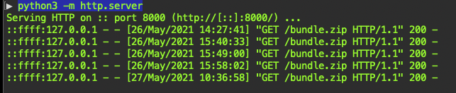
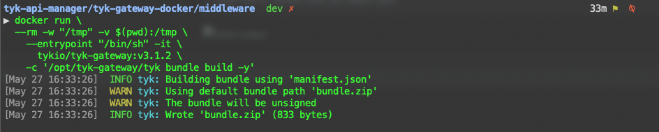
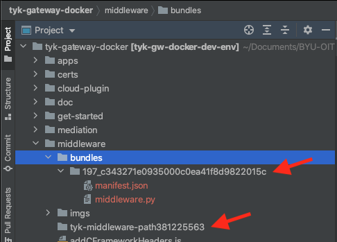

#Project middleware development
___
##Development Process...

###Files
* manifest.json
* middleware.py

I use a few terminals open for this process because I like to have the logs in a slim but really wide window,
and I have another terminal open and sitting in the middleware folder in the Projects Root folder.
> ./middleware/

We'll need to have a python http server serving the files in this folder for the Tyk Docker, yes this is weird
but it helps to get ready to upload the bundles to the Cloud where they will eventually be installed.
``` 
$ python3 -m http.server
```
* 

When you are ready to build and add the bundle, stop Tyk Gateway, say it's still '369'
``` 
$ docker stop 369
```
We stop the Tyk Container because it appears that Tyk Gateways only LOAD Bundles when it starts up. The bundles are pre-loaded and cached for performance.

Run this command to build the bundle:
```
$ docker run \
  --rm -w "/tmp" -v $(pwd):/tmp \
    --entrypoint "/bin/sh" -it \
      tykio/tyk-gateway:v3.1.2 \
    -c '/opt/tyk-gateway/tyk bundle build -y'
```
This runs an entirely different Docker Container and just runs the /opt/tyk-gateway/tyk executable with the 'bundle build -y' options.

> insert link to 'bundle build and switch defs'

* 

Now start up the Tyk Gateway again, (still 369)
``` 
$docker run 369
```
When the Tyk Gateway starts up it will look for the bundle.zip in the location served by the URL set in the tyk.conf
```  
"bundle_base_url": "http://host.docker.internal:8000/",
```
When you go back to the project there will be new files in the project:
* 

These files will need to be deleted if you need to make changes and re-build the bundles.
